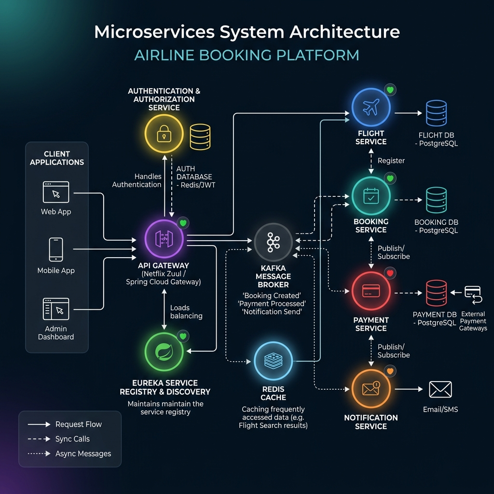
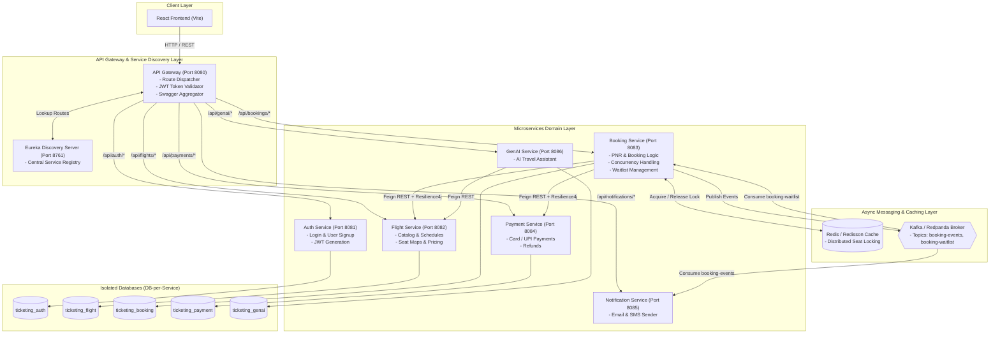
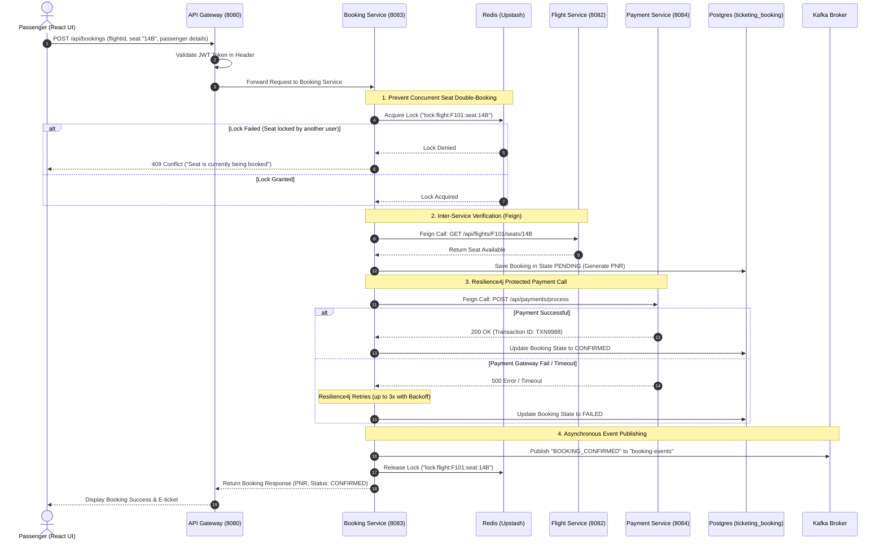
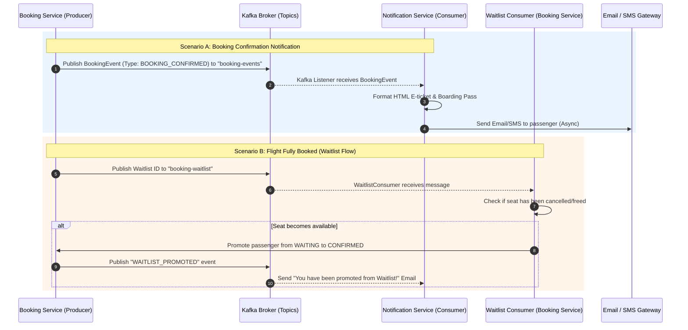
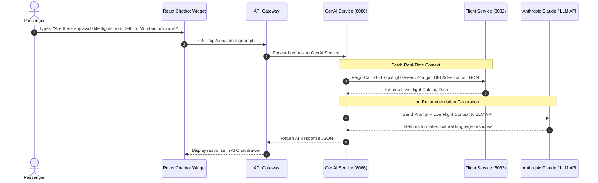

# ✈️ Distributed Flight Ticketing & Reservation Platform

A modern, highly resilient, event-driven microservices platform built for high-concurrency flight ticket bookings, real-time seat locks, automated notifications, and AI-powered travel assistance.

---

## 📐 Architecture Overview



The system follows a **Database-per-Service** microservices architecture. Microservices register with **Spring Cloud Netflix Eureka** for service discovery and communicate via **API Gateway**, synchronous **OpenFeign** REST calls, and asynchronous **Apache Kafka** event streams.



---

## 🛠️ Technology & Infrastructure Breakdown

| Service / Component | Technology Used | Purpose & Functionality |
| :--- | :--- | :--- |
| **Eureka Server** | Spring Cloud Netflix Eureka | Service discovery & registration registry (`http://localhost:8761`). |
| **API Gateway** | Spring Cloud Gateway, Netty, JWT | Single entry point (Port 8080), route dispatching, CORS management, JWT authorization verification, and unified Swagger API aggregation. |
| **Auth Service** | Spring Security, JWT, PostgreSQL | User sign-up, login authentication, role-based access control (User/Admin), password hashing, and JWT token issuance. |
| **Flight Service** | Spring Boot, JPA, PostgreSQL | Flight catalogs, schedules, origin/destination routes, seat inventory, pricing tiers, and admin management. |
| **Booking Service** | Spring Boot, Redisson, Kafka, Feign, Resilience4j, PostgreSQL | Booking orchestration, PNR generation, concurrency control via Redis locks, waitlist management, and publishing lifecycle events to Kafka. |
| **Payment Service** | Spring Boot, PostgreSQL | Payment processing (Credit Card, UPI, Netbanking simulation), refunds, and idempotent transaction handling. |
| **Notification Service** | Spring Boot, Kafka Consumer | Event-driven consumer listening to Kafka topics to asynchronously send booking confirmations, e-tickets, and cancellation alerts via Email/SMS. |
| **GenAI Service** | Spring Boot, Claude / LLM API, OpenFeign, PostgreSQL | Conversational AI assistant helping passengers query flights, luggage rules, and itinerary details in natural language. |
| **Frontend** | React, Vite, Modern CSS | Responsive user interface with real-time seat maps, dark mode, booking management, and interactive AI chatbot drawer. |

---

## 🚀 Key Feature Implementations

### 1. ⚡ Event-Driven Architecture (Apache Kafka / Redpanda Cloud)
- **Producers**: `booking-service` publishes lifecycle events (`BOOKING_CREATED`, `BOOKING_CONFIRMED`, `BOOKING_CANCELLED`, `SEAT_FREED`) to topic `booking-events`, and waitlist items to `booking-waitlist`.
- **Consumers**:
  - `notification-service` consumes `booking-events` to trigger asynchronous Email/SMS alerts.
  - `booking-service` (`WaitlistConsumer`) consumes `booking-waitlist` to automatically promote waiting passengers when seats free up.

### 2. 🔴 Concurrency & Race-Condition Prevention (Redis / Redisson)
- Uses **Redisson Distributed Locking** (`lock:flight:<flightId>:seat:<seatNumber>`) in `booking-service`.
- Guarantees that if two passengers attempt to book seat `14B` on the same flight at the exact same millisecond, only **one** transaction succeeds, avoiding double-booking.

### 3. 🛡️ Fault Tolerance & Resilience (Resilience4j)
- `booking-service` wraps inter-service calls to `payment-service` using **Resilience4j Circuit Breakers** and **Exponential Backoff Retries** (up to 3 attempts).
- Protects the platform from cascading failures during high payment gateway latencies or transient network glitches.

### 4. 🔗 Inter-Service REST (Spring Cloud OpenFeign)
- Declarative HTTP clients enable synchronous communication between microservices via Eureka dynamic lookup (`lb://flight-service`, `lb://payment-service`).

---

## 🔄 Sequence Flows

### Flight Booking & Seat Lock Flow



### Kafka Async Notifications & Waitlist Flow



### AI Travel Assistant Flow (GenAI Service)



---

## 📡 Service Ports & Database Mapping

| Service Name | Port | Context Path | PostgreSQL Database |
| :--- | :---: | :--- | :--- |
| **API Gateway** | `8080` | `/` | — |
| **Eureka Server** | `8761` | `/` | — |
| **Auth Service** | `8081` | `/api/auth` | `ticketing_auth` |
| **Flight Service** | `8082` | `/api/flights` | `ticketing_flight` |
| **Booking Service** | `8083` | `/api/bookings` | `ticketing_booking` |
| **Payment Service** | `8084` | `/api/payments` | `ticketing_payment` |
| **Notification Service** | `8085` | `/api/notifications` | — |
| **GenAI Service** | `8086` | `/api/genai` | `ticketing_genai` |

---

## ⚡ Quick Start & Execution Guide

### Prerequisites
- Java 17+
- Node.js 18+ & npm
- PostgreSQL running locally on port `5432` with databases created (`ticketing_auth`, `ticketing_flight`, `ticketing_booking`, `ticketing_payment`, `ticketing_genai`).

### 1. Launch All Microservices
Run the automated script from the root directory:
```bash
./start-backend.bat
```
*(Or run `start-all.ps1` in PowerShell)*

Check Eureka Dashboard at: `http://localhost:8761`

### 2. Launch Frontend Application
```bash
cd Frontend
npm install
npm run dev
```
Open `http://localhost:5173` in your browser.
